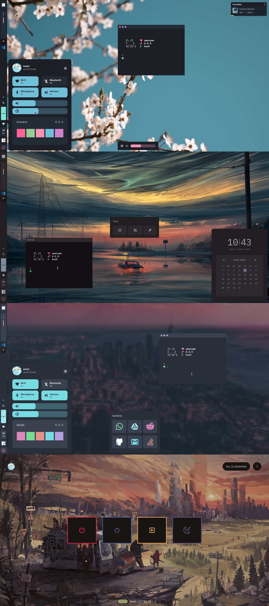
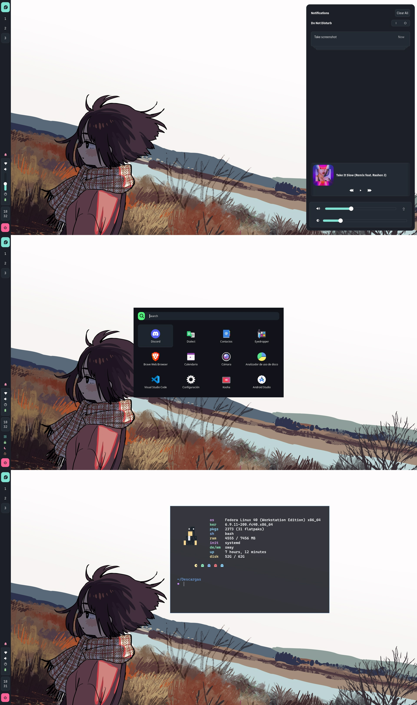

<!-- PROFILE PICTURE -->
<p align="center">
  
</p>

<!-- NAME PROYECT -->
<p align="center">
  <b>~ osmarmora05's configuration files ~</b>
</p>

<!-- STATISTCS -->
<div align="center"> 
   
   
   
   
   

</div>

> [!Important]
> My dotfiles is being managed by [GNU stow](https://www.gnu.org/software/stow/)

<!-- RICES -->
| <center><a href="../awesome.md">AwesomeWM</a><center>                                                              |
| ------------------------------------------------------------------------------------------------------------------ |
| <a href="../awesome.md"></a>                                 |

| <center><a href="../sway.md">Sway</a><center>                                                                      |
| ------------------------------------------------------------------------------------------------------------------ |
| <a href="../sway.md"></a>                                            |


Clone this repository

```shell
git clone https://github.com/osmarmora05/dotfiles-stow.git --recursive
```